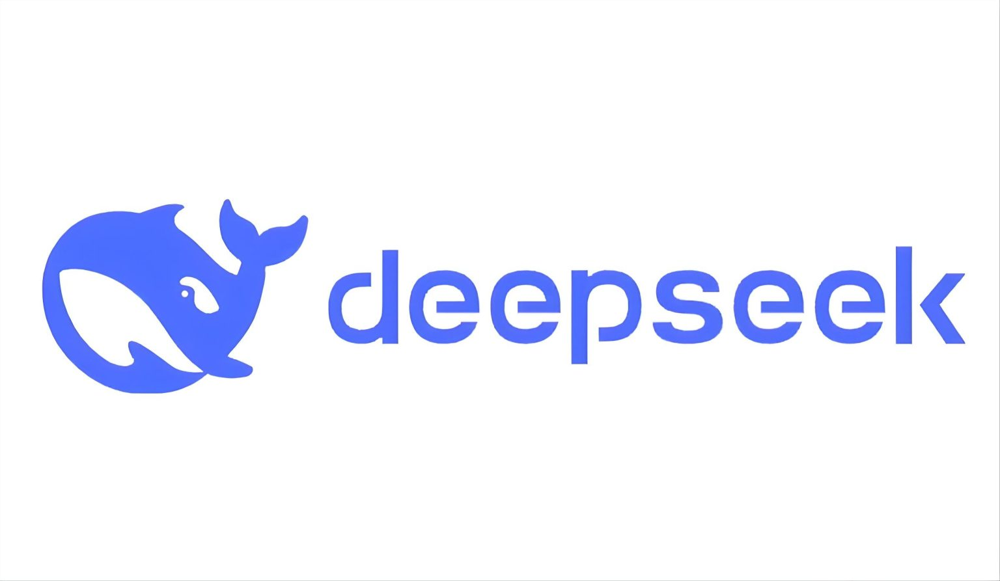

# Guía de Instalación de DeepSeek R1 en local para windows

# Índice

* [DeepSeek](#DeepSeek)

* [Instalación con ollama](#Instalación-con-ollama)

* [Instalación con LLM Studio](#Instalación-con-LLM-Studio) 

* [Pruba ](#Instalación con ollama) 

* [Autor](#Autor)

 [Volver al Índice](#Índice)

# Autor

José R. Guignan
- Mail: joserguignan@gmail.com
- Linkedin: [https://www.linkedin.com/in/jrguignan/](https://www.linkedin.com/in/jrguignan)
- Portafolio: [https://jrguignan.github.io/](https://jrguignan.github.io/)