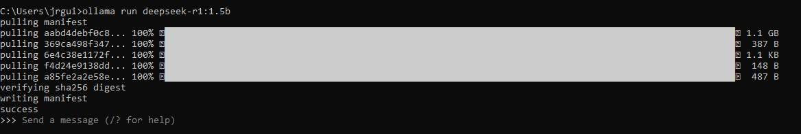

# Guía de Instalación de DeepSeek R1 en local

*Nota:* Este repositorio se terminó de crear el 04/02/2025.

# Índice

* [DeepSeek](#DeepSeek)

* [Instalación con ollama](#Instalación-con-ollama)

* [Prueba](#Prueba) 

* [Conclusión](#Conclusión) 

* [Página DeepSeek](#Página-DeepSeek) 

* [Autor](#Autor)

# DeepSeek

DeepSeek es una empresa china de inteligencia artificial fundada en julio de 2023 por Liang Wenfeng, con sede en Hangzhou, 
China. La compañía se especializa en el desarrollo de modelos de lenguaje de gran escala (LLMs) de código abierto, ofreciendo
 alternativas más accesibles y económicas en comparación con otras soluciones en el mercado.

Uno de sus modelos destacados, DeepSeek-R1, proporciona respuestas comparables a las de modelos avanzados como GPT-4 de OpenAI,
 pero con costos de entrenamiento significativamente menores y requerimientos de computación reducidos. Este enfoque ha permitido
  a DeepSeek ofrecer soluciones de IA de alto rendimiento a una fracción del costo, democratizando el acceso a tecnologías 
  avanzadas de inteligencia artificial. 

La estrategia de DeepSeek de hacer que sus algoritmos y modelos sean de código abierto ha generado un impacto considerable 
en la industria de la IA, desafiando a gigantes tecnológicos establecidos y fomentando una mayor adopción de prácticas abiertas 
en el desarrollo de inteligencia artificial.

## Modelos

Para el modelo R1, hay varios submodelos que varian en la cantidad de parámetros, peso y por ende las capacidades de la maquina
 a utilizar.

* 1.5b pesa 1.1 Gb
* 7b   pesa 4.7 Gb
* 8b   pesa 4.9 Gb
* 14b  pesa 9.0 Gb
* 32b  pesa 20.0 Gb
* 70b  pesa 43.0 Gb
* 671b pesa 404.0 Gb

 [Volver al Índice](#Índice)

# Instalación con ollama

1.- ir al siguiente link [ollama](https://ollama.com/download/windows), descargar e instalar el programa. 

2.- Escoger el modelo a descargar en la siguiente [página](https://ollama.com/library/deepseek-r1), escoger el modelo a descargar y 
copiar el comando de descarga que aparece arriba a la derecha **ollama run deepseek-r1:1.5b**, se escogerá este en muestro caso por las 
capacidades de la máquina donde lo instalaremos. 

 

3 - Ejecutar ollama en un command prompt con el comando **ollama**. Te aparecerá la siguiente pantalla: 

y luego pegar **ollama run deepseek-r1:1.5b** para descargar. Apareciendo la siguiente pantalla.
 El modelo más liviano en mi caso. despues de esto ya se puede interactuar con deepseek desde el command prompt

4 .- Para usar una interface más amigable se puede descargar el pluging 
[page assist-chrome](https://chromewebstore.google.com/detail/page-assist-a-web-ui-for/jfgfiigpkhlkbnfnbobbkinehhfdhndo?pli=1). 
Para usarlo se debe abrir el pluging y luego escoger el modelo a utilizar, nuestro caso **deepseek-r1:1.5b**

 [Volver al Índice](#Índice)

# Página DeepSeek

[www.deepseek.com](https://www.deepseek.com/)

Es necesario registrarse en la pagina. Ya en la pagina se puede acceder al modelo R1 y se pueden obtener las
 credenciales para su api a un precio mas bajo que el OpenAI.

# Prueba

De esta lista de números (2 3 4 8 6 7 ) cuales son números primos?

 

# Conclusión

Aunque DeepSeek todavía tiene margen de mejora, su nivel de desempeño 
es realmente impresionante, especialmente considerando que puede ejecutarse
 en local. Esto no solo abre nuevas posibilidades para desarrolladores e 
 investigadores, sino que también nos da un adelanto del futuro de los modelos
  LLM, donde el acceso a inteligencia artificial avanzada será cada vez más 
  eficiente, accesible y personalizable. Sin duda, estamos presenciando el inicio
   de una nueva era en la evolución de la IA.

 [Volver al Índice](#Índice)

# Autor

José R. Guignan
- Mail: joserguignan@gmail.com
- Linkedin: [https://www.linkedin.com/in/jrguignan/](https://www.linkedin.com/in/jrguignan)
- Portafolio: [https://jrguignan.github.io/](https://jrguignan.github.io/)